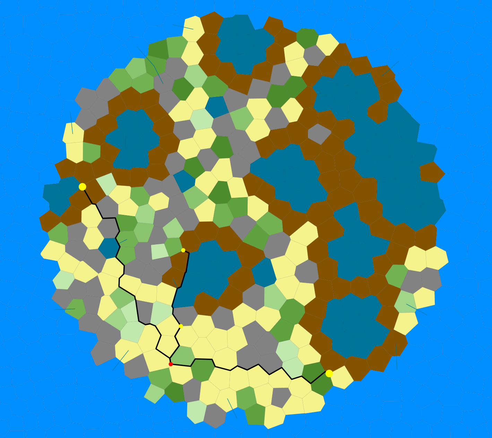

# Urbanism (Assignment #4)

- Author: Amaan Khakiani

## How to install?

```
user A4 % mvn install clean package
```

### Run the Code to create Cities

1. `java -jar generator/generator.jar -k irregular -h 1080 -w 1920 -p 1000 -s 20 -o input.mesh` to generate mesh
2. `java -jar island/island.jar -i input.mesh -o island.mesh -s circle -b arctic -e hills -l 11 -a 5 -r 11 -soil dry -c 50` to generate 50 cities which you can change by altering the number after -c
3. `java -jar visualizer/visualizer.jar -i island.mesh -o island.svg` to visualize
```
user A4 % java -jar pathfinder/pathfinder.jar
```


